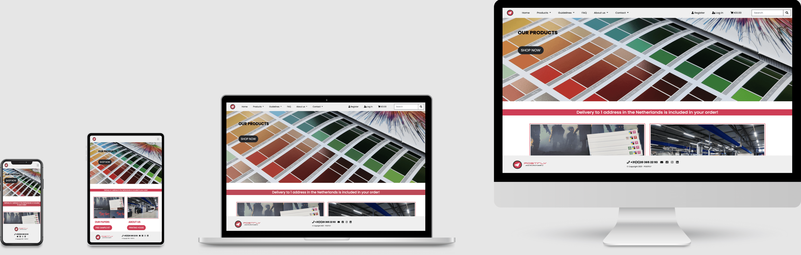
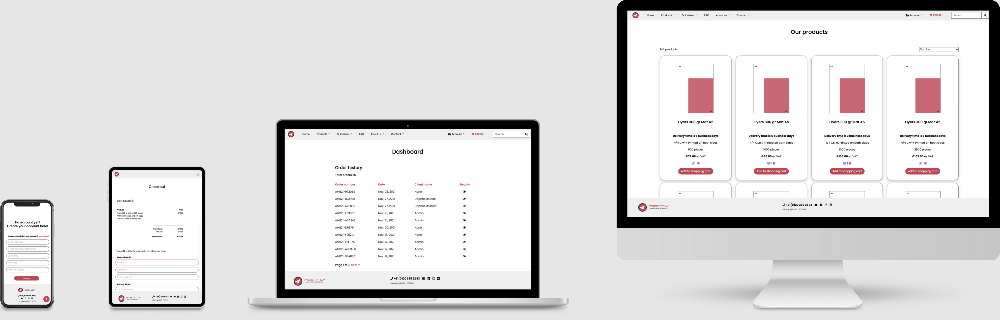

POSTFLY 
Jouw online drukkerij!
======

**[Code Institute](https://codeinstitute.net/)  Milestone Project 4: Full Stack Frameworks with Django**

POSTFLY is a site where you can order all your necessary printed matter online.
[POSTFLY](http://www.postfly.nl/) already has an existing site, but it needs an update.
The existing site as it is now no longer meets the needs of customers and employees. This is a first draft for the company's new site and in this case is for educational purposes only. For this reason only a few of the many products are used on this site.

The focus with this site is to combine knowledge about everything conserning printed matter with what was learned during the Code Institute course.
The site's goal is to have a more efficient system for employees and a easy to understand order system for B2B customers.

:clapper: Demo
======

By clicking this [link](https://postfly-jouw-online-drukkerij.herokuapp.com/) a live demo version will be visible.

<a href="#top">🔝</a>

:open_file_folder: Table of Contents
======

**

UX
**
* [**_User stories_**](#user-stories)
    * [_Strategy_](#strategy)
    * [_Scope_](#scope)
    * [_Structure_](#structure)
    * [_Skeleton_](#skeleton)

**

Features
**
* [**_Existing Features_**](#existing-features)
* [**_Features for the future_**](#features-for-the-future)

**

Technologies
**
* [**_Languages_**](#languages)
* [**_Libraries and frameworks_**](#libraries-and-frameworks)
* [**_Wireframes_**](#wireframes)
* [**_Tools_**](#tools)

**

Testing and Bugs
**
* [**_Testing file_**](#testing-file)

**

Deployment
**
* [**_Deployment_**](#deployment)

**

Credits
**
* [**_Content_**](#content)
* [**_Code_**](#code)
* [**_Media_**](#media)
* [**_Other_**](#other)
* [**_Acknowledgements_**](#acknowledgements)

 

<a href="#top">🔝</a>

:busts_in_silhouette: UX
======

This is meant to be a B2B site which targets visitors who are in need of printed matter, such as flyers, posters, business cards, etc.

### User stories

 

<a href="#top">🔝</a>

### Strategy

The design goal is to make a clear, accessible, structured site so that visitors can easily order their printed matter.

### Scope

For customers, the site should be an improvement over the existing site. Frequently heard complaints with the existing site include that it is not clear where the artwork should be uploaded and that the payment system is not working.
If this can be done, it will also ease the workload of the employees, by solving many complaints and questions related to the site.
The site shows a homepage with links to different parts of the site. It contains a products page where the different products are displayed. There is a files section which gives guidance on how to prepare your digital files and a frequently asked question page for the answers to most asked questions. Furthermore there is a section "About us" which gives a bit of background information about the company and there is a contact section where a contact form can be used, a sample kit request form and a quotation form can be filled out.
The site also contains a register page, a log in page and a shopping cart which will color red and update the price when there is a product in the cart.
The register link will dissapear when logged in and the login link will change to account, where the dashboard, profile and logout link will be displayed. When you are a logged in admin there will also be a product management link.

| Nav menu | Logged in User | Logged out User |
 --- | --- | ---
Home| &#9989; | &#9989; |
Products |&#9989; | &#9989; |
Files|&#9989; | &#9989; |
FAQ| &#9989; | &#9989; |
About us| &#9989; | &#9989; |
Contact | &#9989; | &#9989; |
Register| &#10060; | &#9989; |
Log in| &#10060; | &#9989; |
Account| &#9989; | &#10060; |
Dashboard| &#9989; | &#10060; |
Profile| &#9989; | &#10060; |
Log out| &#9989; | &#10060; |
Shopping cart | &#9989; | &#9989; |

A difference has also been made in user rights:
| Options | Standard User Account | Admin User Account |
 --- | --- | ---
Add products | &#10060; | &#9989; |
Update products | &#10060; | &#9989; |
Delete products | &#10060; | &#9989; |
See own orders| &#9989; | &#9989; |
customers | &#10060; | &#9989; |
Edit profile| &#9989; | &#9989; |

### Structure

The site will be structured as clear as possible, with a logic workflow and it should be easy to navigate the site on all screen sizes. 

### Skeleton

The skeleton section is a bit more extensive, for that reason please view this separate [file](readme/skeleton/README.md).

### Fonts and icons

[Google Fonts](https://fonts.google.com/) was used to embed the Poppins font in the code. Poppins was chosen because this has a good readability and fits the company's identity.
[FFONTS](https://www.ffonts.net/Syntha-Regular.font.download) was used to get the Syntha Regular font for the subtext of the logo.
For the icons [Font Awesome](https://fontawesome.com/) was used.

<a href="#top">🔝</a>

:star2: Features
======

### Existing Features

The site contains the following features: 
- A page with an overview of all the products which can be sort by name, price and category.
- A frequently asked questions page.
- Pages with tips and tricks about designing / handing in artwork.
- A contact form where customers can ask questions.
- A form where customers can request a quotation or deviating products / products that are not on the site but we may have.
- A sample kit form where customers can request a sample kit with our paper types.
- A register page.
- A login page.
- A page for when the customer forgot their password.
- An order sytem, to order the products and upload the artwork for the products.
- A dashboard, with the order history.
- A profile page to adjust the user's details. 

### Features for the future 

The following features can be added: 

- An option to choose the language, Dutch or English. Default will be Dutch. The start has already been made by making most of the translations, but due to able to submit this project in time, this feature has been moved to a future update.
- Integrate the previously created project POSTFLY Business card creator into this site, so that customers can create their design on the site instead of uploading their separately made artwork.
- A chat function for live chat with an employee.
- An artwork upload system where a customer can check their artwork themself.
- An option to have multiple billing and delivery addresses for one user.
- An option to see the status of the order on the dashboard.

<a href="#top">🔝</a>

:gear: Technologies
======

### Languages

- HTML
- CSS
- Python
- JavaScript

### Libraries and Frameworks

- Bootstrap
- Postgres
- Stripe
- Pillow
- Boto3
- Django
- Django-allauth
- Django-crispy-forms
- Django-countries
- Django-livereload-server

### Wireframes

- [Adobe XD](https://www.adobe.com/products/xd.html)

### Tools

- [Adobe Photoshop](https://www.adobe.com/products/photoshop.html): to resize the images.
- [Adobe Illustrator](https://www.adobe.com/products/illustrator.html): to create the logo.
- [VSCode](https://code.visualstudio.com/): to write the code in.
- [Heroku](https://www.heroku.com/): as a host for the deployed site.
- [GitHub](https://github.com/): for the repository.

<a href="#top">🔝</a>

:test_tube: :bug: Testing and Bugs 
======

### Testing file

The tests have been done on multiple devices and browsers. In the end everything works as intended. Because this topic contained more content than expected, a separate page was created.
For more details about testing and bugs please view this [file](readme/testing/README.md).

<a href="#top">🔝</a>

:computer: Deployment
======

### Deployment

The deployment section is a bit more extensive for that reason please view this separate [file](readme/deployment/README.md).

<a href="#top">🔝</a>

:copyright: Credits
======

### Content
Most content has been written by me, the technical stories regarding the delivery of the files and the origin of the printing company come from the sites of [POSTFLY](http://www.postfly.nl/) and [Grafische Groep Matthys](https://www.groepmatthys.com/) and were sometimes adjusted by me. Prices are based on the product price from the original site, and adjusted here and there, but are for learning purposes only for this project. No rights can therefore be derived from this.

### Code
1. [Code Institute LMS Full Stack Frameworks with Django Boutique Ado project by Chris Zielinski](https://learn.codeinstitute.net/courses/course-v1:CodeInstitute+FSF_102+Q1_2020/courseware/4201818c00aa4ba3a0dae243725f6e32/d3188bf68530497aa5fba55d07a9d7d7/?child=first) this was used as the basis of the code and then modified to make it my own site.
2. [Hover.css](https://ianlunn.github.io/Hover/) to learn how to let the buttons on the home page grow on hover.
3. [W3 Schools](https://www.w3schools.com/howto/howto_css_parallax.asp) to learn how to create the parallax effect.
4. [W3 Schools](https://www.w3schools.com/howto/howto_css_loader.asp) to learn how to create the loader on the payment process page.
5. [Tutorial](https://simpleisbetterthancomplex.com/tutorial/2016/08/01/how-to-upload-files-with-django.html) to learn how to upload files with Django.
6. [CI Alumni Aukje van der Wal](https://gitlab.com/Aukje/Dark-Luna/-/blob/master/contact/forms.py) for learning how to set up the contact form and matching email with it.
7. [CI Django Heimgartner](https://github.com/D1ang/Digipress) and [Lokalise](https://lokalise.com/blog/django-i18n-beginners-guide/) to understand how to set up translation files.

<a href="#top">🔝</a>

### Media

#### Images
1. [POSTFLY](http://www.postfly.nl/) the POSTFLY logo provided by my colleague Filip Matthys, for the joboptions and base of the templates, and for the images on the deep black and resolution (sunflower image) page.
2. [Flaticon](https://www.flaticon.com/free-icon/paper-plane_164627?term=paper%20plane&page=3&position=52&page=3&position=52&related_id=164627&origin=search) to get and adjust the paper plane of the logo.
3. [favicon.io](https://favicon.io/favicon-converter/) was used to get the favicon of the logo and the Dutch flag.
4. [Color-hex](https://www.color-hex.com/) was used to get the images of the colors that were used.
5. [Grafische Groep Matthys](https://www.groepmatthys.com/) for their logo,  the images of some foil samples and the foil fan, the head office and the presses, thanks for my colleague Bart Lauwaert for providing the original photos to me and for the how to cold foil pdf.
6. [WPJournalist](https://wpjournalist.nl/avatar-maken/) to create the avatars of the team.
7. [Adobe Stock](https://stock.adobe.com/nl) for the images on the speicifications, file type, color, resolution (dpi image), templates, FAQ, concept, contact, quotation, register, login, forgot password page and the illustrator file for the mockup image. These are licensed images downloaded with a paid Adobe Stock account.
8. [Cleanpng](https://www.cleanpng.com/png-ink-cartridge-printer-toner-printing-color-drops-2337753/download-png.html) for the cmyk image of the 404 and 500 error page, text added with Adobe Illustrator.
9. The other images on the site and the screenshots of indesign etc. are my own photos and screenshots.

### Other
1. [Luchidchart](https://www.lucidchart.com/pages/) to create the Django diagram model.
2. [Tinypng](https://tinypng.com/) to resize the wireframe png's.
3. [Django Secret Key Generator](https://miniwebtool.com/django-secret-key-generator/) to get a new secret key for Django
4. [Django livereload server](https://github.com/tjwalch/django-livereload-server) to learn how to not have to refresh the page every time.
5. [Travis](https://www.travis-ci.com/) voor testing the settings.py and the forms for the contact, sample kit and quotation request pages.

### Acknowledgements
- My mentor from Code Institute, thank you Narender for your time and guidance.
- My husband, thank you Django for taking more care of our son so I can work on my education, and thank you for your patience and guidance in the time I had a lot of mental breakdowns.
- Special thanks to CI former students Aukje van der Wal and Django Heimgartner whose projects Dark Luna and Silkscreenservice learnt me a lot.
- A huge thanks to the incredible CI tutor support for helping me a out a lot of times during this project.
- Special thanks to CI fellow student Gwendolyn Jo for lifting my spirits during multiple mental breakdowns.
- Special thanks to my colleagues, friends and family for their support, tips and for testing my project.

<a href="#top">🔝</a>
