:open_file_folder: Table of Contents
======

**<details><summary>Deployment</summary>**
* [**_Live version_**](#live-version)
* [**_Run local_**](#run-local)
* [**_Heroku_**](#heroku)
* [**_Setting EmailJS up_**](#setting-emailjs-up)
</details>
<br>

:computer: Deployment
======

### Live version

To view the deployed version, the steps underneath can be followed:

1. Go to [GitHub](https://github.com/)
2. Find Daph1986's [page](https://github.com/Daph1986)
3. Select repositories.
4. Select the postfly_jouw_online_drukkerij
repository.
5. Click on the link on the right side or on the link under `Demo`.
By clicking that link the live demo version will be visible. <br>

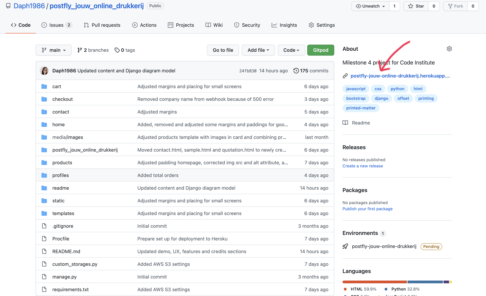
<!--  -->
<div align="right"><a href="#top">🔝</a></div>

The code of this site is hosted by Heroku and AWS S3, the code is deployed to GitHub from the main branch. The deployed site will update automatically upon new commits to the main branch. The code can be run locally or deployed to a live environment. Directions are based on deployment locally and to Heroku.

### Deploy requirements
- [VScode](https://code.visualstudio.com/) or an other IDE
- [Python 3](https://www.python.org/) a programming language
- [PIP3](https://help.dreamhost.com/hc/en-us/articles/115000699011-Using-pip3-to-install-Python3-modules) to install python packages
- [Git](https://git-scm.com/) for version control for the code source
- [AWS-S3](https://docs.aws.amazon.com/s3/?id=docs_gateway) web based cloud storage service
- [S3 Bucket](https://docs.aws.amazon.com/AmazonS3/latest/userguide/creating-bucket.htmly) a cloud storage resource
- [Stripe](https://stripe.com/nl) to securely collect credit card payments
<div align="right"><a href="#top">🔝</a></div>

### Run local
If you would like to run this website locally you can clone this repository in an IDE such as VSCode. Make sure that `PIP3` and `Git` are installed.
You can clone it by following the next steps: <br>
1. Log in at [GitHub](https://github.com/) 
2. Find Daph1986's [page](https://github.com/Daph1986)
3. Select repositories.
4. Select the `postfly_jouw_online_drukkerij` repository.
5. Click on the `Code` button. <br>
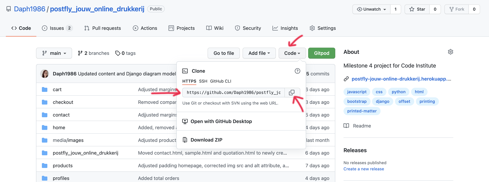 <br>
6. Copy the URL.
7. Open VScode or your preferred IDE,(in this example we are using VScode), open the file or folder in which you want to use the project and open a CLI terminal.
8. Put the following command in the CLI terminal:
``` 
git clone https://github.com/Daph1986/postfly_jouw_online_drukkerij.git
```
9. Press enter, and the clone will be created.
10. Set up a virtual environment with these commands in the terminal session:
```
pip3 install virtualenv
```
>If you already have virtualenv installed from a different project, then this step is not needed. The pip command may differ per system this can be pip or pip3.
```
virtualenv env
```
>The needed command may differ to the IDE you are using, such as ```python -m .venv venv ...``` or ```py manage.py ...

Activate the .env with the command:
```
env\Scripts\activate
```
>This command may differ depending on your operating system, please check the Python documentation on creating an ENV.
11. Install all required django modules with the command:
```
pip3 install -r requirements.txt
```
12. Create a new env.py file at the base directory level and copy the following into the created env.py file:
```
import os

#Django
os.environ.setdefault( 'DEVELOPMENT', 'True')
os.environ.setdefault('SECRET_KEY', 'your_value')

#Stripe
os.environ.setdefault('STRIPE_PUBLIC_KEY', 'your_value')
os.environ.setdefault('STRIPE_SECRET_KEY', 'your_value')
```
Replace `your_value` with the values from your own created accounts for stripe and a [Django Secret Key Generator](https://miniwebtool.com/django-secret-key-generator/):
- [STRIPE_PUBLIC_KEY](https://dashboard.stripe.com/test/apikeys)
- [STRIPE_SECRET_KEY](https://dashboard.stripe.com/test/apikeys)
- [SECRET_KEY](https://miniwebtool.com/django-secret-key-generator/)
13. Set up your database by running the following command in your terminal:
```
python3 manage.py make migrations
```
Followed by:
```
python3 manage.py migrate
```
14. Now create a superuser to get access to the Django admin, use the following command:
```
python3 manage.py createsuperuser
```
15. Now we need to add the required data into the database in the following order by using the following commands:
```
python3 manage.py loaddata categories
python3 manage.py loaddata printingmethod
python3 manage.py loaddata size
python3 manage.py loaddata producttag
python3 manage.py loaddata products
```
16. Now you can start your server with the following command:
```
python3 manage.py runserver
```
If everything went correctly you should see something like this in the terminal:<br>
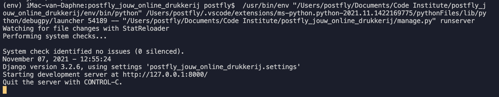 <br>
<div align="right"><a href="#top">🔝</a></div>

### Heroku
To create a live version of the website VSCode was used together with Heroku. This section assumes you have succeeded at running the application in your local environment first, as described above. 
To deploy the website with Heroku the following steps were made:
1. Log in or create an account on [Heroku](https://www.heroku.com) and create a new app by clicking the button.<br>
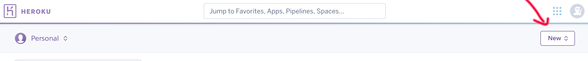 <br>
2. Give the app a unique name in all lowercase letters and set `Choose a region` to the one nearest to you (in this case Europ and 
postfly_jouw_online_drukkerij is already taken so think of another name), click on create app.<br>
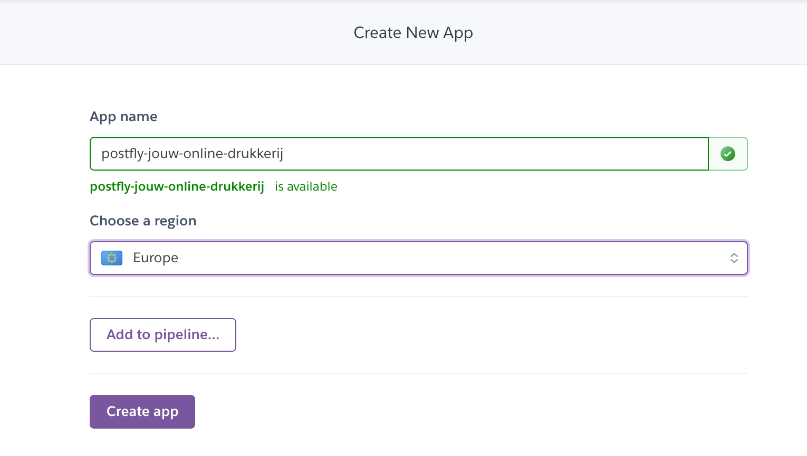 <br>
3. On your app dashboard click `Deploy` and select `GitHub`, connect it to your GitHub respository. Don't click `Enable Automatic Deploys` yet.<br>
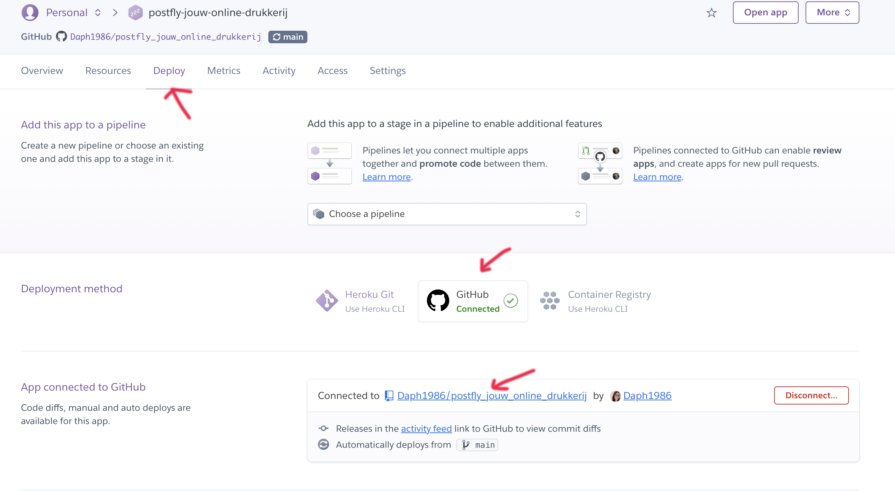 <br>
4. Click on the `Resources` tab and type Heroku Postgres in the `Add-ons` field, select the `Hobby Dev` option.
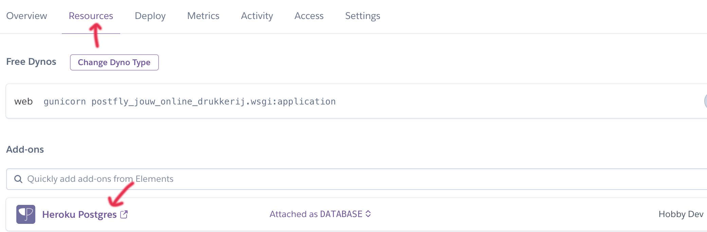 <br>
5. Click on `Settings` and then `Reveal Config Vars`. <br>
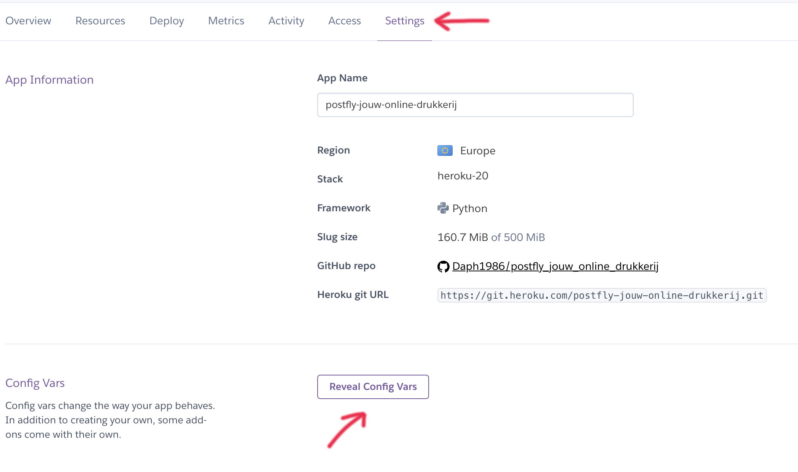 <br>
6. Fill in the values from your `env.py` file in your Heroku confic vars: <br>

| Key | Value |
 --- | ---
DATABASE_URL | `your_DATABASE_URL`
SECRET_KEY | `your_SECRET_KEY`
STRIPE_PUBLIC_KEY | `your_STRIPE_PUBLIC_KEY`
STRIPE_SECRET_KEY | `your_STRIPE_SECRET_KEY`

The DATABASE_URL link which can be found in Heroku's Config Vars.
7. Since the database on Heroku is created you need to adjust your `env.py` file, add:
```
os.environ.setdefault('DATABASE_URL', '<your postgres url grabbed from Heroku comes here>')
```
>Make sure not to share this link with anybody.
8. Now we need to migrate the new database connection with:
```
python3 manage.py make migrations
```
Followed by:
```
python3 manage.py migrate
```
>Do not forget to reactivate your virtual environment if the system or IDE is rebooted.
9. Now create a superuser to get access to the Django admin, use the following command:
```
python3 manage.py createsuperuser
```
10. Now we need to add the required data into the database in the following order by using the following commands:
```
python3 manage.py loaddata categories
python3 manage.py loaddata printingmethod
python3 manage.py loaddata size
python3 manage.py loaddata producttag
python3 manage.py loaddata products
```
11. Install Heroku in the terminal, if you don't have that 
yet see how to do that [here](https://devcenter.heroku.com/articles/heroku-cli) and log in with the command: 
```
heroku login
```
12. Then use the command:
```
heroku config:set DISABLE_COLLECTSTATIC=1 --app postfly-jouw-online-drukkerij
```
so that Heroku will not try to collect static during deployment.

13. After everything is set up as it should use the following commands to push to GitHub and Heroku:
```
git add .
git commit -m "Place your own commit message here"
git push
heroku git: remote -a your heroku git url
git push heroku main
```
You will then see something like this in your terminal:
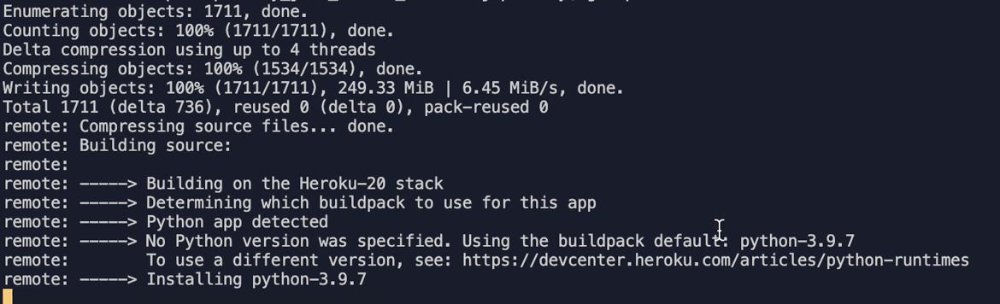 <br>

14. If you want you can let the deployment to Heroku be automatically everytime you push to GitHub, on your app dashboard click `Deploy` and click `Enable Automatic Deploys`.
If you go to the `Activity` tab on your app dashboard you can see that there is a build in progress, the details will look a bit like this:
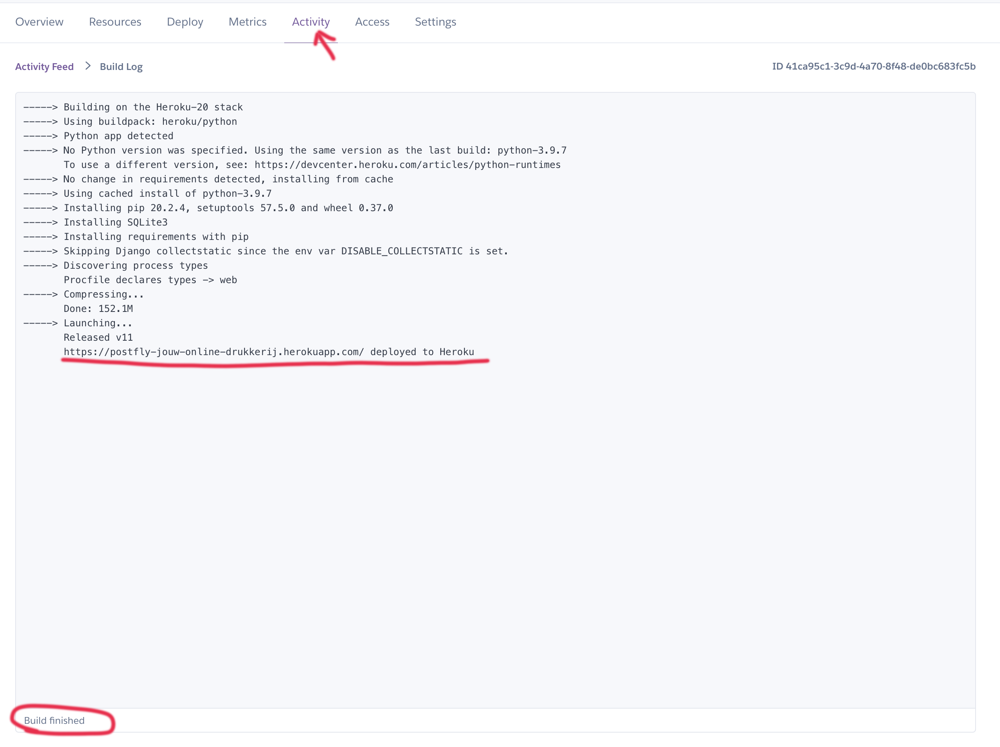 <br>
Your app is running on Heroku now.

15. Log in to the admin panel by placing /admin behind your app name, for example for this one: https://postfly-jouw-online-drukkerij.herokuapp.com/admin
Using the superuser log in details log in.

>!!! If you don't see your email address you may need to attempt to log in first to force allauth to create it !!!

Go to `Email addresses` underneath `ACCOUNTS`, and mark `Primary` and `Verified` for the superuser email address, save the changes you made.

16. Create a new webhook endpoint on the Stripe dashboard. <br>
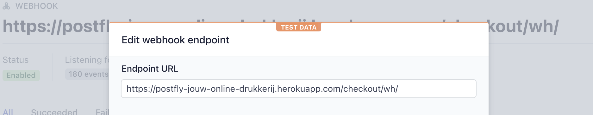 <br>

17. Reveal your webhooks siging secret and add it to the Heroku Confic Vars:

| Key | Value |
 --- | ---
STRIPE_WH_SECRET| `your_STRIPE_WH_SECRET`

<div align="right"><a href="#top">🔝</a></div>

### Set up Amazon AWS

To follow the next steps make sure you have an Amazon AWS account and that you are logged in.

#### S3 Bucket

1. In the AWS Management Console search for S3, open it and click `Create bucket`
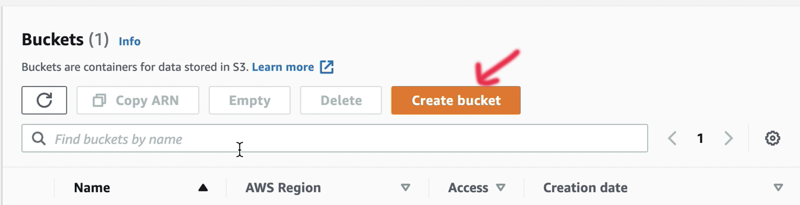 <br>
2. Name your bucket to match your Heroku app name and select the region closest to you. Uncheck `Block all public access` and acknowledge that the bucket will be public.
Click `Create bucket`.
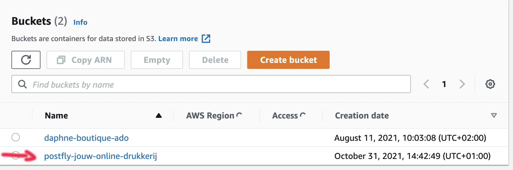 <br>
3. Click your newly made bucket and cick the `Properties` tab and turn on `Static website hosting`, just fill in a default value for the index and error document and click save.
4. Now click on the `Permissions` tab, with the Cross-origin resource sharing (CORS) fill in:
```
[
    {
        "AllowedHeaders": [
            "Authorization"
        ],
        "AllowedMethods": [
            "GET"
        ],
        "AllowedOrigins": [
            "*"
        ],
        "ExposeHeaders": []
    }
]
```
Save the changes. <br>

5. Go to `Bucket Policy` and click `Policy generator`, fill it out like this, but with your own arn.
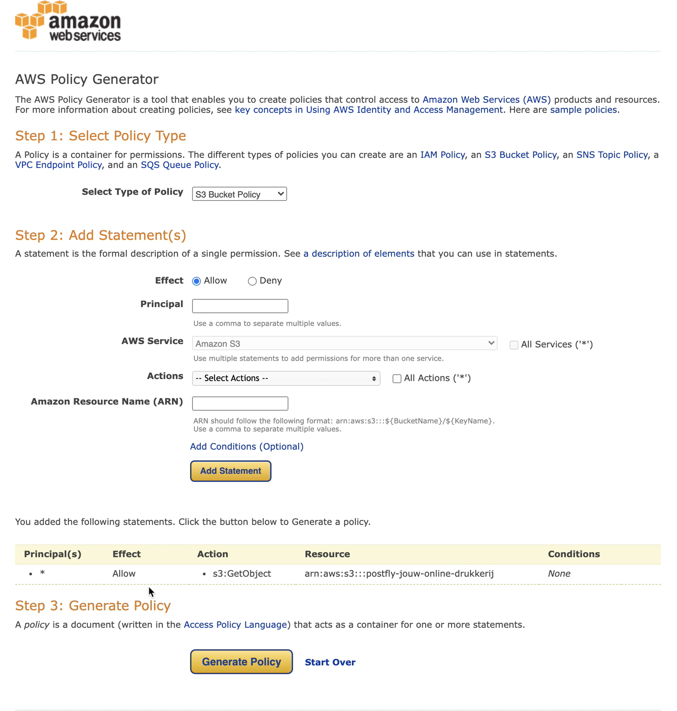 <br>

6. Copy the policy that you get and paste it in the `Bucket policy`, in tis case:
```
{
    "Version": "2012-10-17",
    "Id": "Policy1635688080273",
    "Statement": [
        {
            "Sid": "Stmt1635688076687",
            "Effect": "Allow",
            "Principal": "*",
            "Action": "s3:GetObject",
            "Resource": "arn:aws:s3:::postfly-jouw-online-drukkerij/*"
        }
    ]
}
```
Make sure you add the /* with the resource key to allow acces to all resources in this bucket. Click save.
7. Go to the `Access control list (ACL)` tab and set tge list bojects permission for everyone under the `Public Access` section.
<div align="right"><a href="#top">🔝</a></div>

#### IAM

1. In the AWS Management Console search for IAM, open it.
2. On the IAM dashboard click `User groups` and then `Create group`, name your group so it makes sense to you what it is. Click `Create group`.
3. On the menu left click `Policies` and then `Create Policy`.
4. Click on the `Json` tab and click `Import managed policy`, search for `S3` select the `AmazonS3FullAccess` one. Click import.
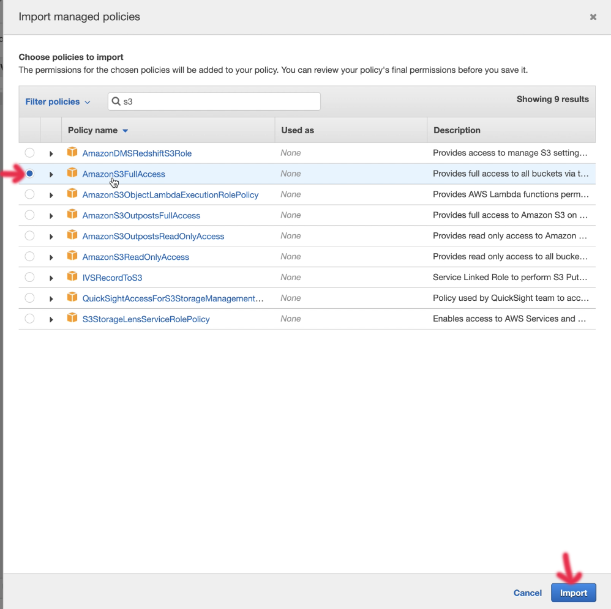 <br>
5. You just want to give permission to your bucket, so make sure you fill it out like this, but with your own arn! 
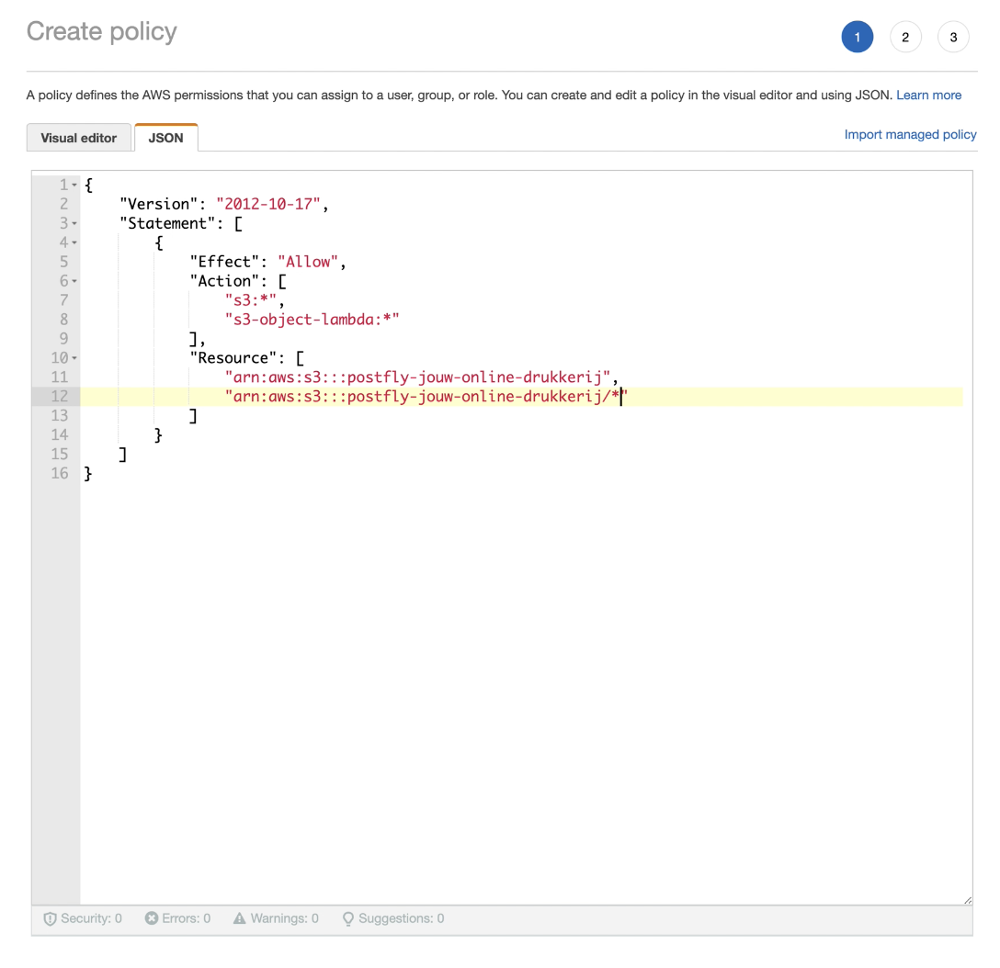 <br>
Click next untill you reach `ReviewPolicy`
6. Give it an name and a description and click `Create policy`.
7. You'll arrive back on the policy page, go to `User groups` in the menu on the left and click on manage-your-group-name.
8. Click `Attach policies` search for and select the policy you just created.
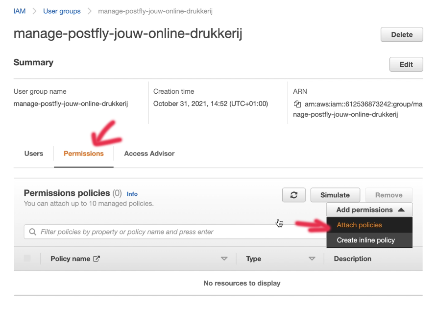 <br>
9. Click on `Users` in the menu on the left. Then click `Add users` name it after your app, in my case postfly-jouw-online-drukkerij-staticfiles-user, give programmatic access and select next. Add the user to the group you just created. Click through on next and then on create user.
10. Download the csv file you see there and save it!
You need the secrect keys in there and once you've done this there is now way to retrieve it!!
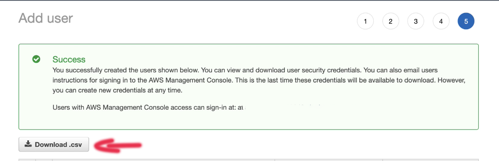 <br>
<div align="right"><a href="#top">🔝</a></div>

#### Connecting AWS to Django

This section assumes you have succeeded at running this application in your local environment first, deployed it to Heroku and set up AWS as described above.

1. Remove the DISABLE_COLLECTSTATIC variable from your `Config Vars` on Heroku and add these values to it:

| Key | Value |
 --- | ---
AWS_ACCESS_KEY_ID | `your_AWS_ACCESS_KEY_ID`
AWS_SECRET_ACCESS_KEY | `your_AWS_SECRET_ACCESS_KEY`
USE_AWS | True

The values you'll find in the downloaded csv file.
Next time you deploy to Heroku, AWS will retrieve your static files and store them.

2. Go to S3, where you'll find a `static` folder with all your static files in it.
3. Click on `Create folder` and name it `media` click save and inside the media folder click `Upload`.
4. Click `Add files` and select the images that go with your products or in this case with the size.
5. Click next and under `Manage public permissions`, and choose `Grant public-read access`.
6. Then click`Upload`, you will see your files being uploaded.<br>
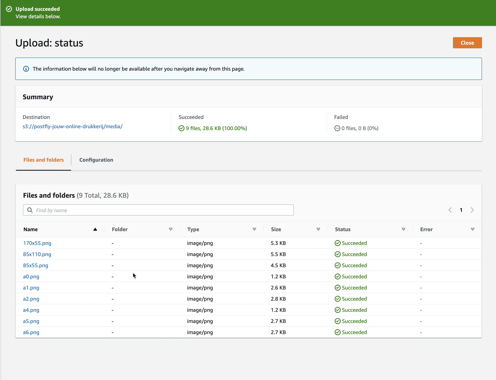 <br>
<div align="right"><a href="#top">🔝</a></div>

### Sending real emails with Gmail

1. Create or use an existing Gmail account.
2. Connect it to your application to the Gmail account. For more information see for example this [site](https://dev.to/abderrahmanemustapha/how-to-send-email-with-django-and-gmail-in-production-the-right-way-24ab) and read `The Gmail part`.
3. Add the values to the Heroku Config Vars:

| Key | Value |
 --- | ---
EMAIL_HOST_PASS | `your_EMAIL_HOST_PASS`
EMAIL_HOST_USER | `your_EMAIL_HOST_USER`

Everything should be ready to go now.
<div align="right"><a href="#top">🔝</a></div>