### Skeleton

On the original site, there are approximately 33 product categories, each of which has multiple paper or material options and then multiple finishes and quantity options.
This project started with 9 different product categories each with up to 10 different paper types, 11 sizes, multiple options for printing methods and finishes and 18 different quantities. After the first mentor meeting, this was thought through again and it was concluded that even this is a bit much for an educational project. Therefore, it was decided to limit it to the following products:
- 4 flyer paper types with each 3 sizes, 3 quantities and 2 delivery time options
- 2 poster paper types with each 3 sizes, 3 quantities and 2 delivery time options
- 2 business card paper types with each 3 sizes, 3 quantities and 2 delivery time options
 
 

The desktop wireframes are listed below per section. 
**

Home
**

<a href="#top">🔝</a>

**

Products
**
 
 

<a href="#top">🔝</a>

**

Shopping cart
**

<a href="#top">🔝</a>

**

Checkout
**
 

<a href="#top">🔝</a>

**

Dashboard
**
 

<a href="#top">🔝</a>

**

Admin Dashboard
**
 

<a href="#top">🔝</a>

**

Profile
**

<a href="#top">🔝</a>

**

Files
**
 
 
 
 
 
 
 
 
 
 
 
 

<a href="#top">🔝</a>

**

FAQ
**

<a href="#top">🔝</a>

**

About us
**
 
 

<a href="#top">🔝</a>

**

Contact
**
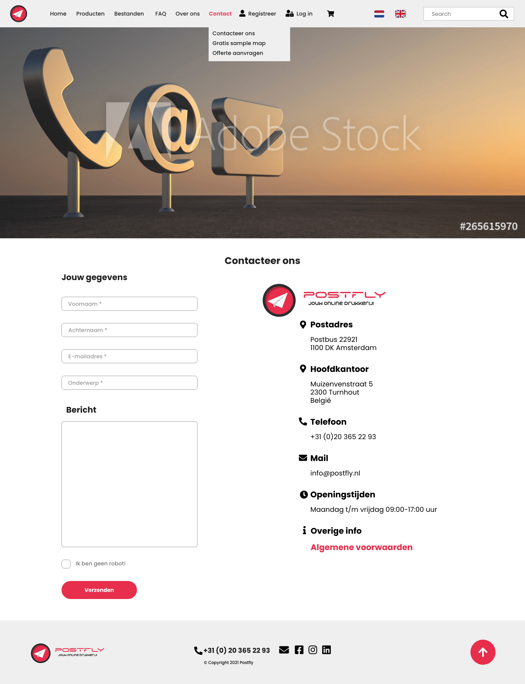 
 

<a href="#top">🔝</a>

**

Register
**

<a href="#top">🔝</a>

**

Log in
**

<a href="#top">🔝</a>

**

Forgot password
**

<a href="#top">🔝</a>

 

Desktop wireframe overview  
 

<a href="#top">🔝</a>

 

The tablet wireframes are listed below per section. 
**

Home
**

<a href="#top">🔝</a>

**

Products
**
 
 

<a href="#top">🔝</a>

**

Shopping cart
**

<a href="#top">🔝</a>

**

Checkout
**
 
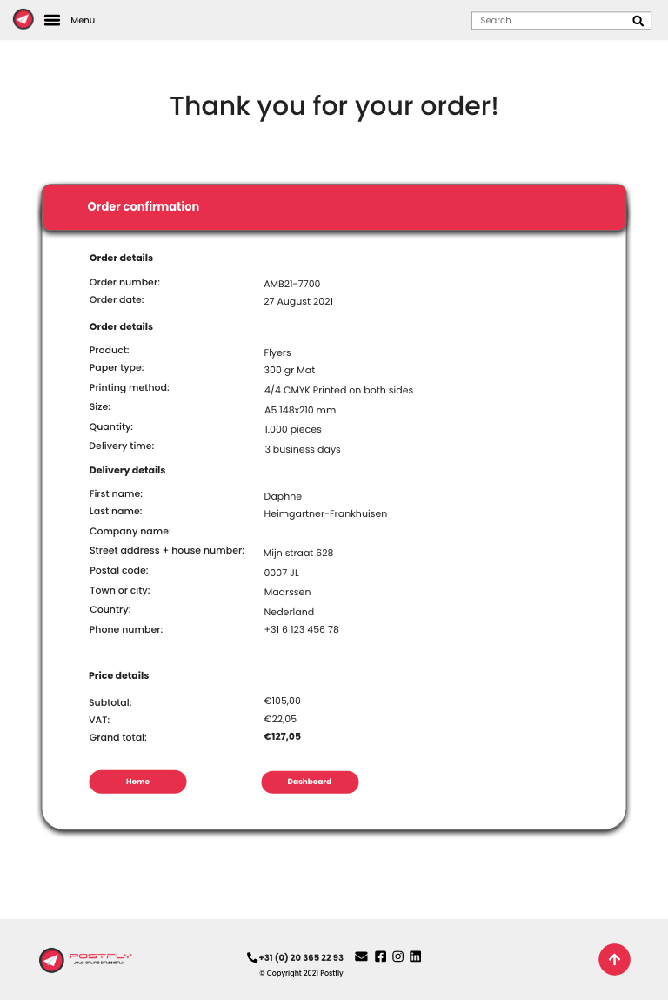

<a href="#top">🔝</a>

**

Dashboard
**
 

<a href="#top">🔝</a>

**

Admin Dashboard
**
 

<a href="#top">🔝</a>

**

Profile
**

<a href="#top">🔝</a>

**

Files
**
 
 
 
 
 
 
 
 
 
 
 
 

<a href="#top">🔝</a>

**

FAQ
**
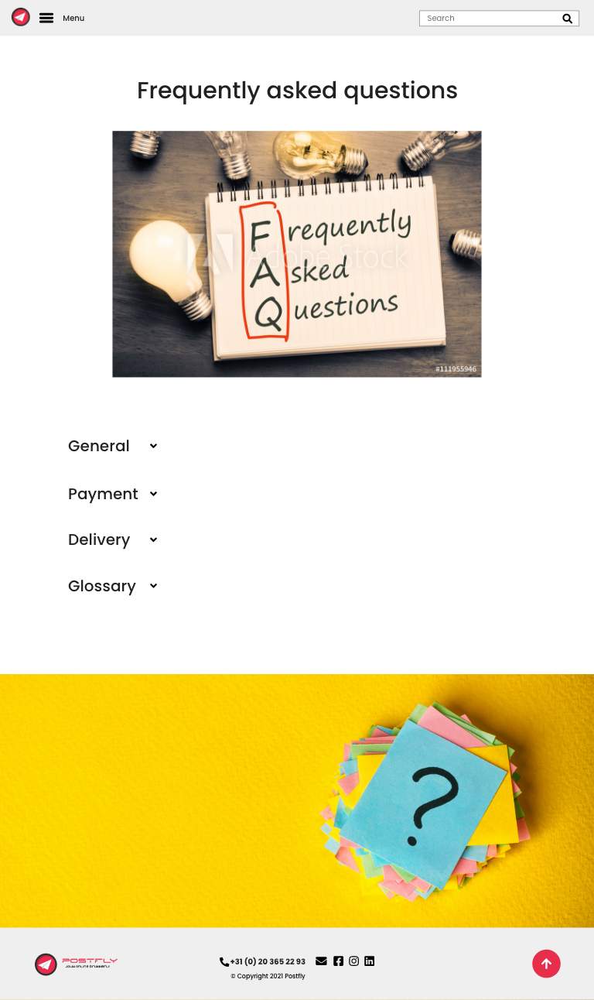

<a href="#top">🔝</a>

**

About us
**
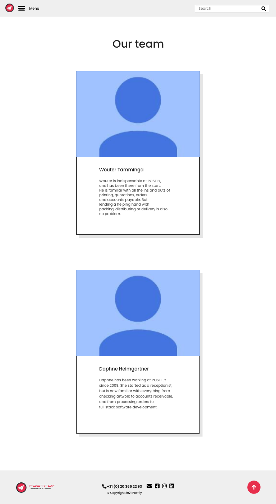 
 

<a href="#top">🔝</a>

**

Contact
**
 
 

<a href="#top">🔝</a>

**

Register
**
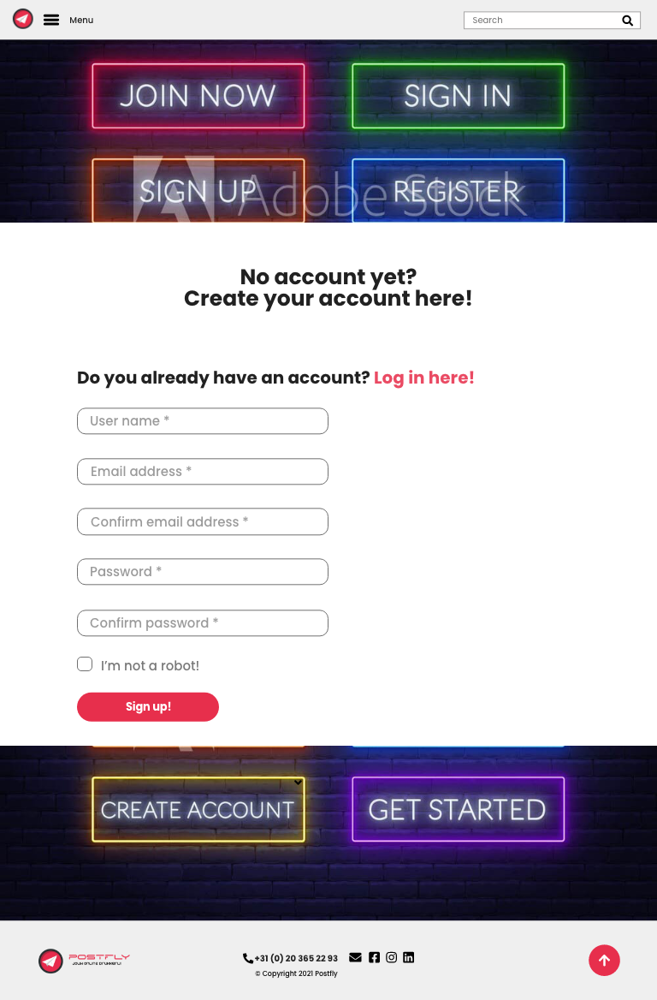

<a href="#top">🔝</a>

**

Log in
**

<a href="#top">🔝</a>

**

Forgot password
**

<a href="#top">🔝</a>

 

Tablet wireframe overview  
 

<a href="#top">🔝</a>

 

The mobile wireframes are listed below per section. 
**

Home
**
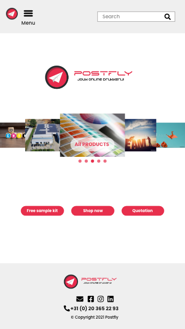

<a href="#top">🔝</a>

**

Products
**
 
 

<a href="#top">🔝</a>

**

Shopping cart
**

<a href="#top">🔝</a>

**

Checkout
**
 

<a href="#top">🔝</a>

**

Dashboard
**
 

<a href="#top">🔝</a>

**

Admin Dashboard
**
 

<a href="#top">🔝</a>

**

Profile
**
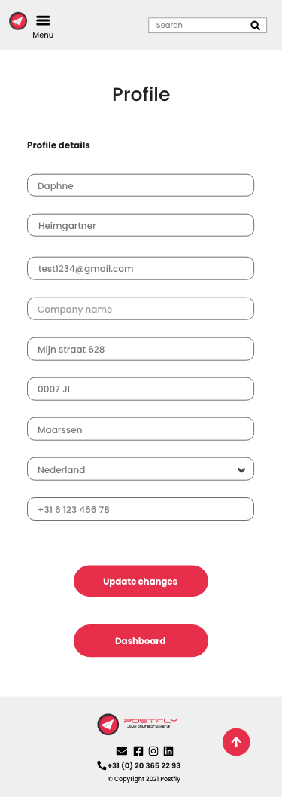

<a href="#top">🔝</a>

**

Files
**
 
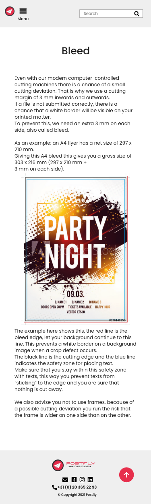 
 
 
 
 
 
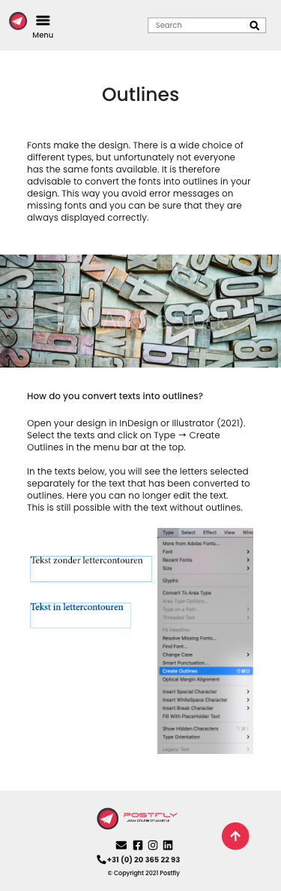 
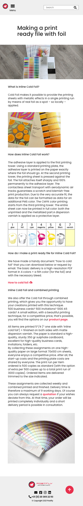 
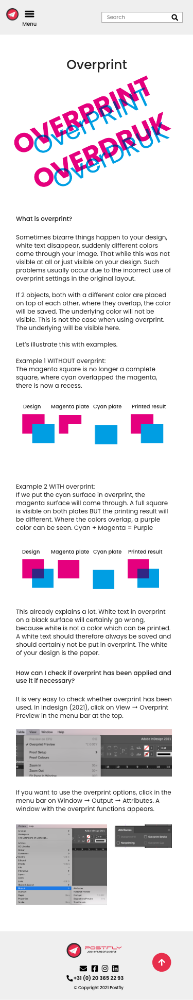 
 
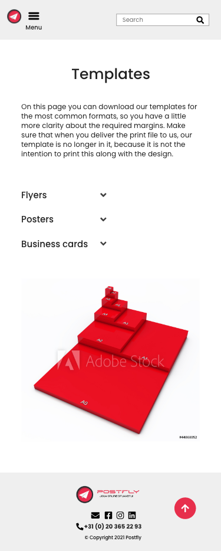 

<a href="#top">🔝</a>

**

FAQ
**

<a href="#top">🔝</a>

**

About us
**
 
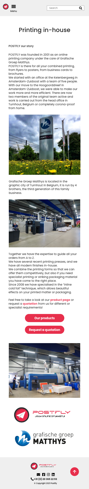 

<a href="#top">🔝</a>

**

Contact
**
 
 

<a href="#top">🔝</a>

**

Register
**

<a href="#top">🔝</a>

**

Log in
**

<a href="#top">🔝</a>

**

Forgot password
**

<a href="#top">🔝</a>

 

Mobile wireframes  
 

<a href="#top">🔝</a>

 

Django diagram model 
The ERD diagram explains the intent for the django backend.
When you have a user profile you can save your data there and the next time you order it will be preloaded, the customer is connected to the user. 
You can also choose to override the default delivery address by changing it in the checkout process and for example, to deliver it to an office address.
In a future update, it should be an option to store multiple delivery and billing addresses for one user. 
 

<a href="#top">🔝</a>

**Surface**

The following main colors have been used: 
 
These colors have been chosen because they are part of the corporate identity. These colors suit the company, so it was decided to continue to use this, but to abandon the other colors of the current site.

<a href="#top">🔝</a>

During development the site's layout was restructured a little bit, because this seemed visually or otherwise better. They are listed below.

1. Home page, the original idea was to have a carousel, bit the site didn't become more appealing because of it, so the choice was made to make use of 3 photos, a banner and 3 buttons.
2. The product details page was skipped to make the ordering proces more customer friendly. The explanation about the paper types was moved to the FAQ page and instead of having to make first a paper choice in the menu and then a size choice on an extra page, the choice was made to do this in the menu right away.
3. The shopping cart was restuctured a bit to make it more logical and easy to read for the customer.
4. The dashboard was altered a bit, the huge red block was not found visually appealing and because of the time, the status of the order was moved to be an update for the future. Same goes for the admin version of the dashboard, there is a special admin dashboard which displays a orders, but it is less extensive than in the wireframe.
5. The switch language option has been moved to a future update due to lack of time, due to handing in the project within the deadline and personal circumstances.
6. The red color #E72F4C  was changed to #E02A51 for better contrast.

<a href="#top">🔝</a>

