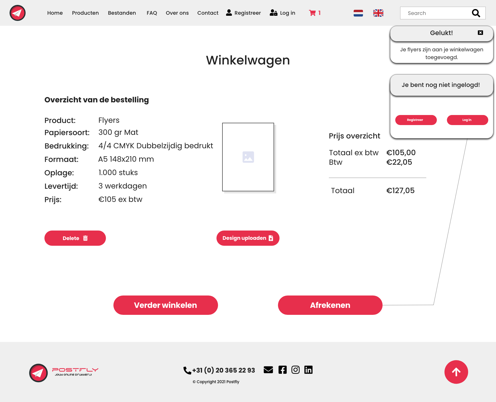
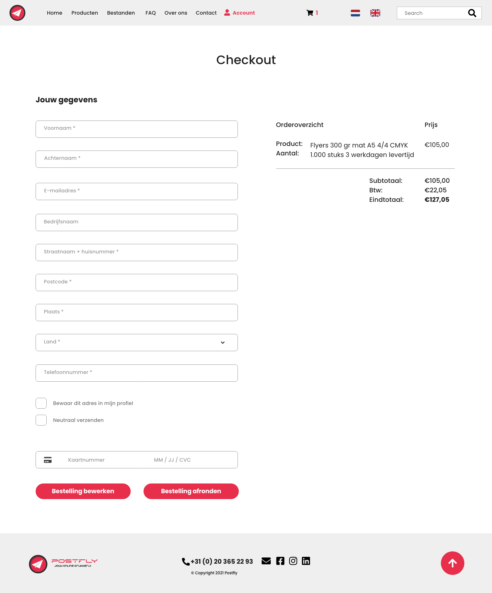
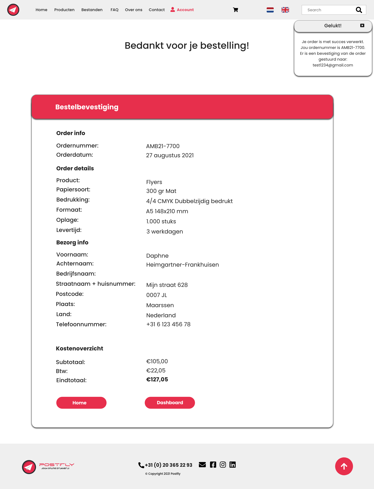
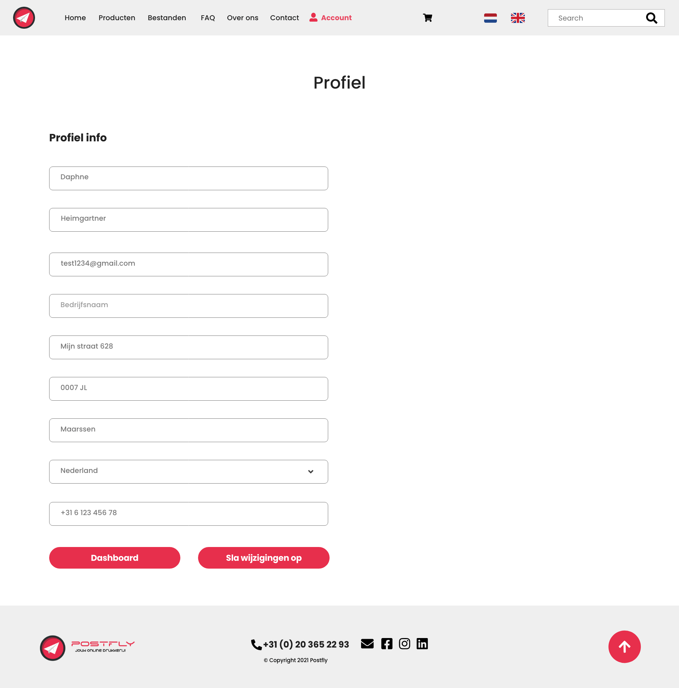
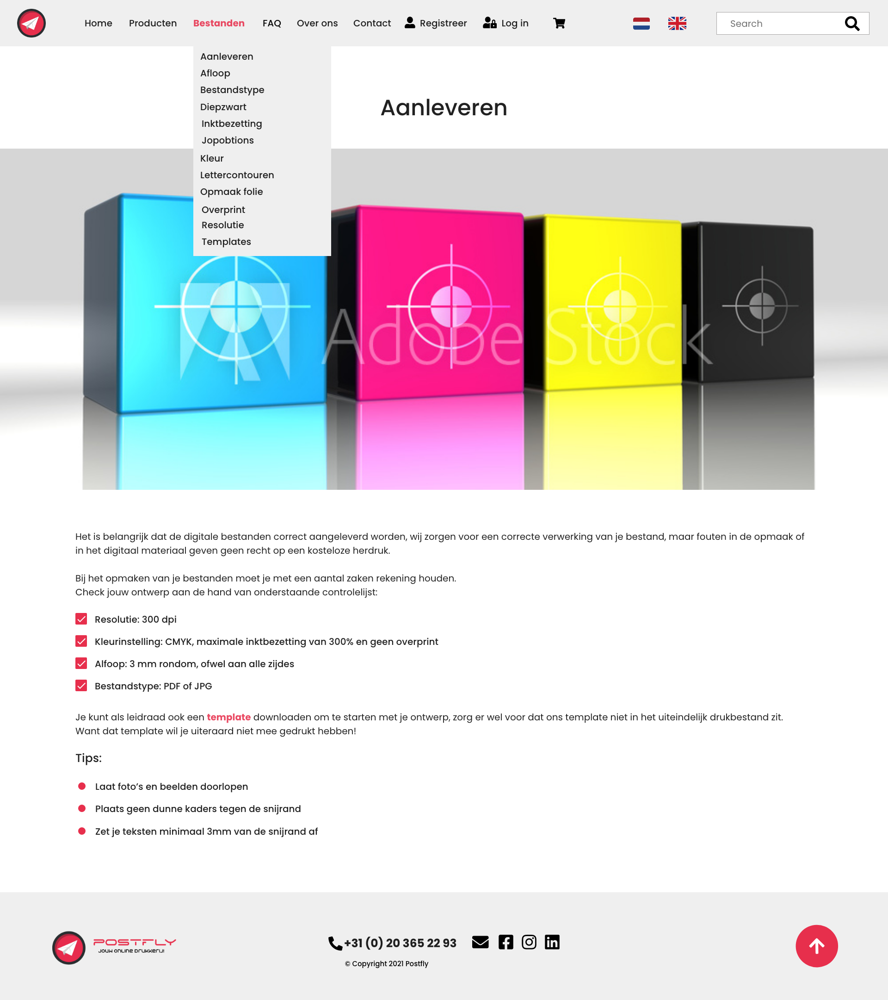
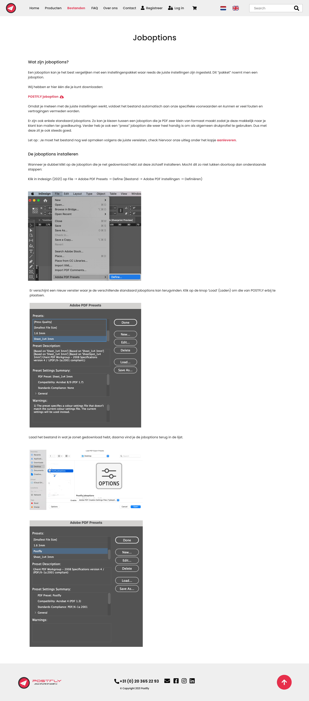
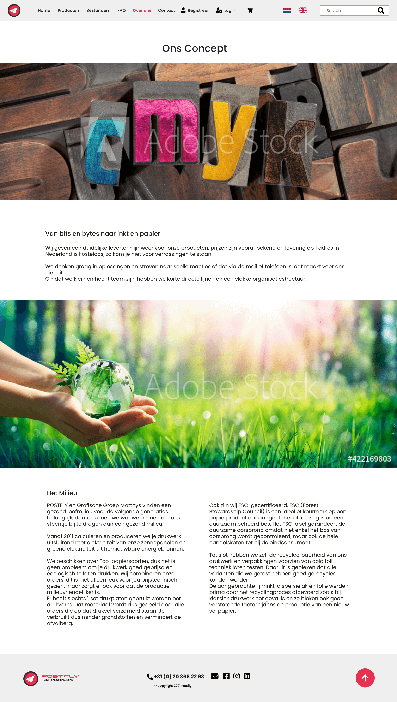
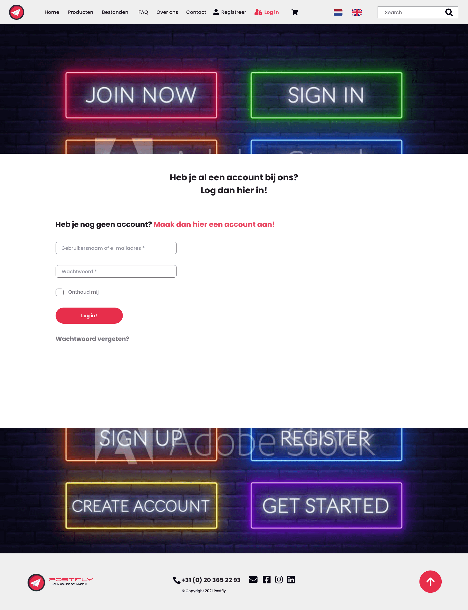
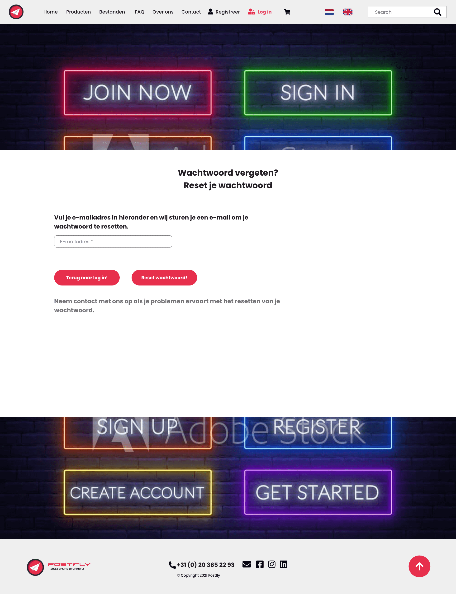
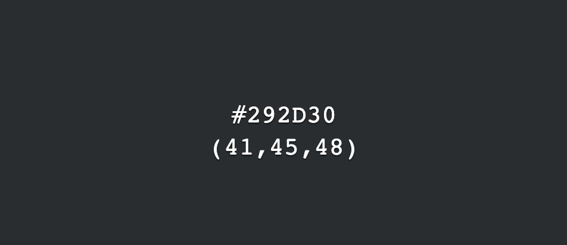

### Skeleton

Desktop wireframe overview  
 
The desktop wireframes are split underneath per section. 
**

Home
**

<a href="#top">ğŸ”</a>

**

Products
**
 

<a href="#top">ğŸ”</a>

**

Shopping cart
**

<a href="#top">ğŸ”</a>

**

Checkout
**
 

<a href="#top">ğŸ”</a>

**

Dashboard
**
 

<a href="#top">ğŸ”</a>

**

Profile
**

<a href="#top">ğŸ”</a>

**

Files
**
 
 
 
 
 
 
 
 
 
 
 
 
 
 

<a href="#top">ğŸ”</a>

**

FAQ
**

<a href="#top">ğŸ”</a>

**

About us
**
 
 

<a href="#top">ğŸ”</a>

**

Contact
**
 
 

<a href="#top">ğŸ”</a>

**

Register
**

<a href="#top">ğŸ”</a>

**

Log in
**

<a href="#top">ğŸ”</a>

**

Forgot password
**

<a href="#top">ğŸ”</a>

 

Tablet wireframe overview  
 

<a href="#top">ğŸ”</a>

Mobile wireframes  
 

<a href="#top">ğŸ”</a>

Django diagram model 
 

<a href="#top">ğŸ”</a>

**Surface**

The following main colors have been used: 
 
These colors have been chosen because they are part of the corporate identity.

<a href="#top">ğŸ”</a>

